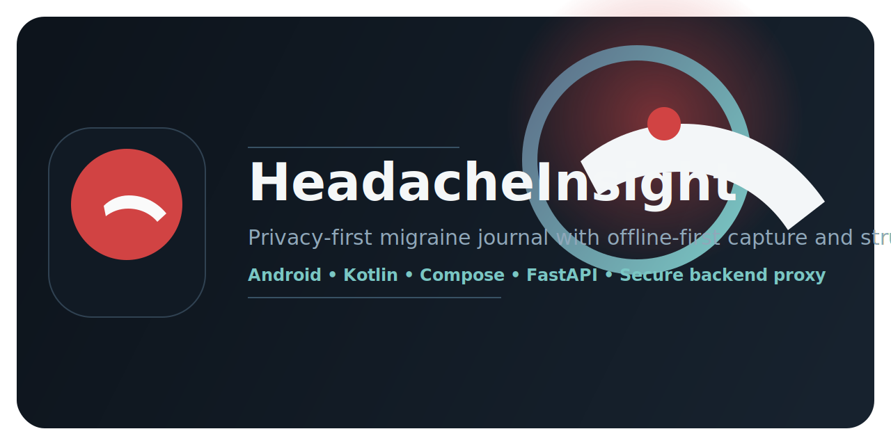

# HeadacheInsight



[](https://github.com/AntonStrobe/HeadacheInsight)

HeadacheInsight is a privacy-first, offline-first Android application for fast headache and migraine episode logging with optional cloud analysis through a secure backend proxy.

## What It Does

- captures a new headache episode in 1-2 actions
- supports voice-first input during acute pain
- keeps structured data local-first with Room as source of truth
- runs deterministic red-flag safety checks offline
- sends data to OpenAI only through a schema-driven backend proxy
- exports patient-friendly and clinician-friendly reports

## Repository Layout

```text
/android-app    Android client
/backend        FastAPI proxy and schema-driven OpenAI integration
/docs           Product, architecture, safety, and build documentation
```

## Key Principles

- Kotlin + Jetpack Compose native Android client
- Multi-module architecture with UI/domain/data separation
- Room as local source of truth
- Voice-first acute logging flow
- Optional cloud analysis through backend only
- Local deterministic red-flag safety engine
- No ads, no trackers, no direct OpenAI calls from Android

## Quick Start

See [docs/build-and-run.md](docs/build-and-run.md) for exact commands.

Typical bootstrap flow:

```powershell
./scripts/bootstrap-windows.ps1
```

Windows build/deploy helper:

```bat
build-headacheinsight.bat
```

Windows GitHub publish helper:

```bat
publish-headacheinsight-github.bat
```

```bash
./scripts/bootstrap-linux.sh
./scripts/bootstrap-macos.sh
```

Backend dev flow:

```bash
cd backend
python -m venv .venv
. .venv/bin/activate
pip install -e .[dev]
uvicorn app.main:app --reload
```

## Release Assets

- GitHub release assets can be uploaded automatically by `scripts/publish-github.ps1`
- the script publishes any already-built APK/AAB files it finds under `android-app/app/build/outputs`
- generated download links follow the GitHub Releases pattern and are printed after upload

## Status

This repository contains the MVP+foundation scaffold and baseline implementation for:

- onboarding, privacy, and settings
- quick episode logging
- local persistence and seed questions
- local red-flag evaluation
- attachment/report/export foundations
- secure backend proxy contracts
- tests, fixtures, docs, and CI scaffolding
- RU/EN startup language selector with Russian-first onboarding flow

## App Icon Workflow

- Generate a transparent `1024x1024` master icon PNG.
- Save it as `img/app-icon-master.png`.
- Rebuild Android launcher assets with:

```powershell
./scripts/generate-android-icons.ps1
```

- The exact GPT-ready generation prompt lives in [img/icon-source-gpt-prompt.md](img/icon-source-gpt-prompt.md).

## GitHub Publish

- Target account: `AntonStrobe`
- Default repository name: `HeadacheInsight`
- First login to GitHub CLI:

```powershell
gh auth login
```

- Then publish:

```powershell
./scripts/publish-github.ps1
```
